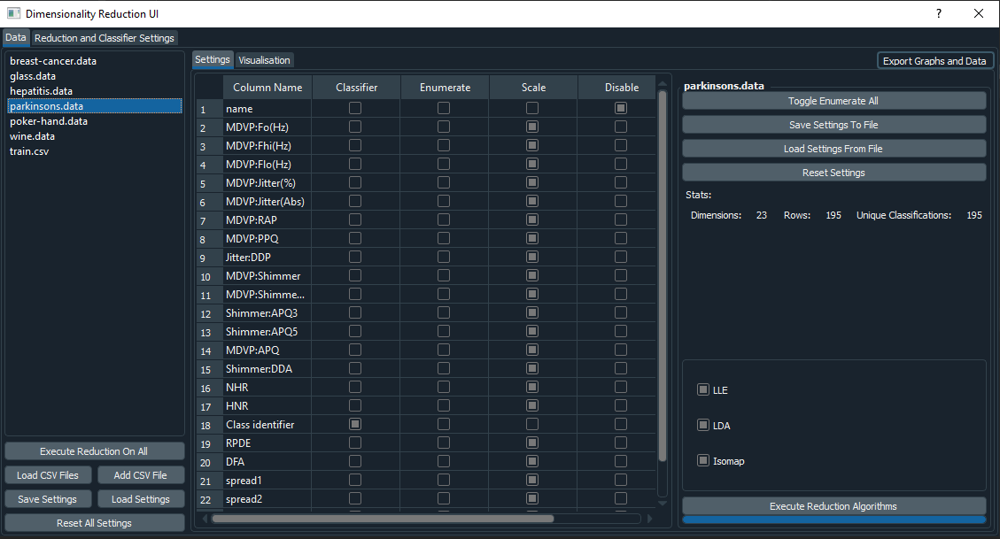
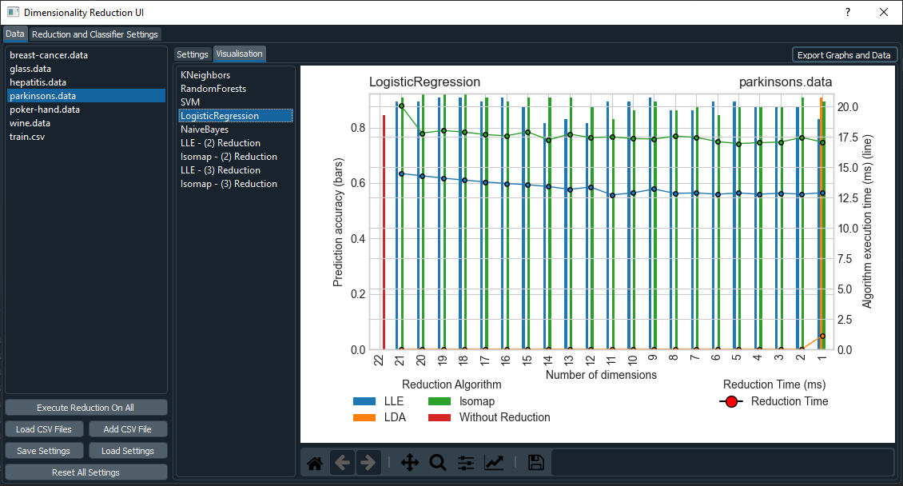
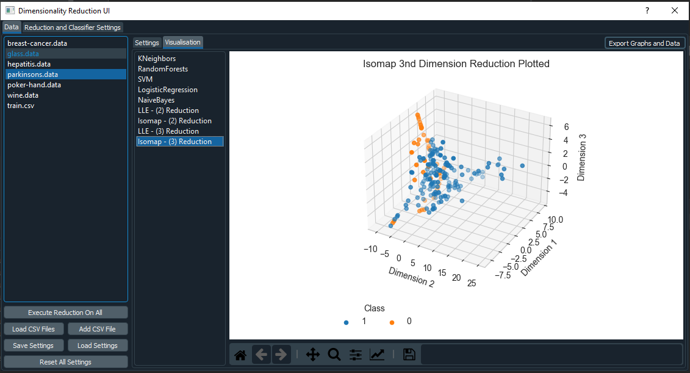

# dimensionality-reduction-ui
A user interface for processing csv files and conducting dimensionality reduction algorithm comparisons


Run `pip install -r requirements.txt` to install all the dependencies 

 
 
 

## Building

```
pyinstaller -F --hidden-import="menu" --hidden-import="classification" --hidden-import="reduction" --hidden-import="data" --hidden-import="fileObject" --hidden-import="sklearn" --hidden-import="sklearn.neighbors._typedefs" --hidden-import="sklearn.utils._weight_vector" --hidden-import="sklearn.utils" --hidden-import="sklearn.neighbors._quad_tree" --noconsole --onefile main.py
```

To enable debugging in the application, use the `--debug=all` flag


